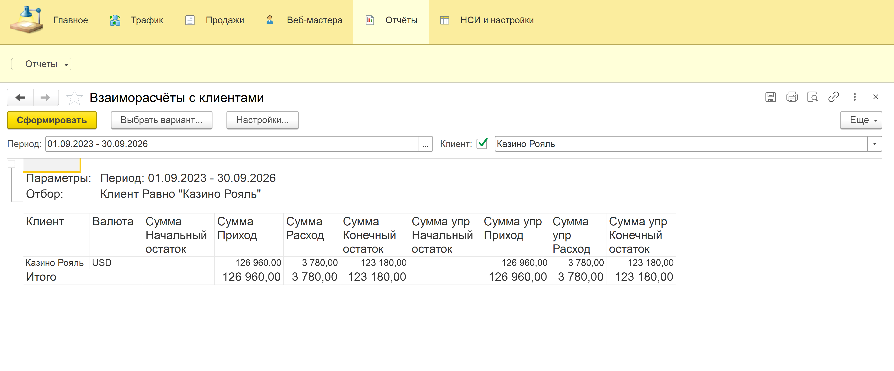
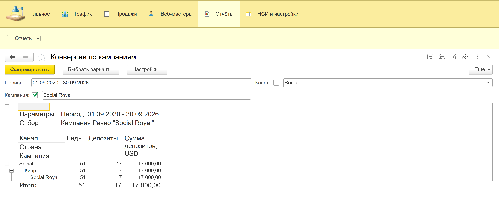
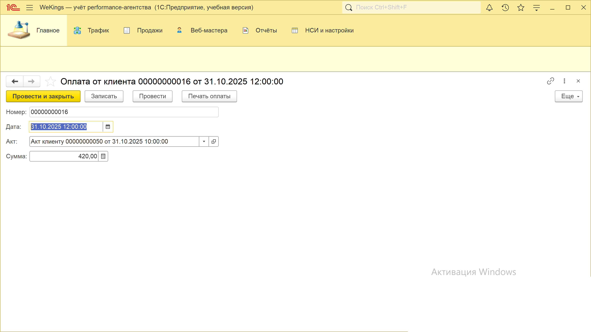
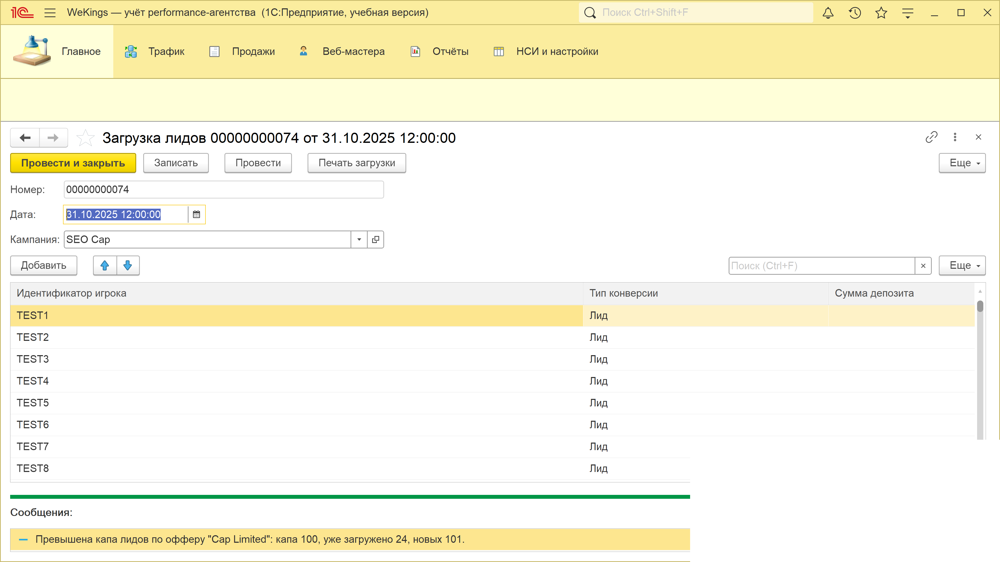

# WeKings — учебная конфигурация 1С:Предприятие 8.3 для performance-агентства (iGaming)

WeKings моделирует учёт performance digital-агентства в сфере iGaming:
клиенты агентства — казино и беттинг-проекты, веб-мастера — источники трафика.
Бизнес-процесс охватывает полную цепочку: загрузка лидов и депозитов,
контроль маркетинговой капы по кампаниям, начисление и выплаты веб-мастерам
по моделям CPA / RevShare / Гибрид, акты клиентам и оплаты — с мультивалютным
учётом и пересчётом в управленческую валюту.

## Реализовано

Модель метаданных:

- **Регистры сведений:** КурсыВалют (периодический), УсловияВебМастеров (периодический: ставка и модель выплаты по паре ВебМастер + Оффер).
- **Регистры накопления:** Конверсии (обороты), ВзаиморасчётыСКлиентами (остатки, валютные + управленческая сумма), ВзаиморасчётыСВебМастерами (остатки), НачисленияВебМастерам (обороты), РекламныеРасходы (обороты).
- **Документы:** ЗагрузкаЛидов, АктКлиенту, ОплатаОтКлиента, НачислениеВебМастерам, ВыплатаВебМастеру, РасходНаРекламу.
- **Справочники:** Валюты, Страны, Клиенты, КаналыТрафика (предопределённые PPC / In-App / Social / SEO / Affiliate), ВебМастера, Офферы (подчинены Клиентам), РекламныеКампании.
- **Отчёты СКД (5):** Конверсии по кампаниям (группировка Канал → Страна → Кампания), Взаиморасчёты с клиентами, Расчёты с веб-мастерами, Выручка по моделям расчёта, ROI по кампаниям.
- **Роли:** Медиабаер, AffiliateМенеджер, Бухгалтер, Руководитель.

Функциональность:

- **Контроль капы** — проверка превышения лимита конверсий по кампании при проведении, превышение отклоняется.
- **Мультивалютность** — взаиморасчёты в валюте документа с пересчётом в управленческую валюту (константа УправленческаяВалюта) по периодическим курсам.
- **Статусы актов** — Черновик / Выставлен / Оплачен (перечисление СтатусыАкта).
- **Печать MXL** — печатная форма акта клиенту на макете табличного документа.
- **Загрузка CSV** — документ ЗагрузкаЛидов с формой пакетной загрузки конверсий из CSV-файла.
- **Идемпотентный сидер тестовых данных** — find-or-create по ключам документов, повторный прогон без дублей.

## Технологии

- Платформа 1С:Предприятие 8.3 (учебная версия), синтаксис — русский.
- Управляемые формы: явные формы только там, где нужна логика модуля
  (загрузка CSV, команда «Заполнить» в акте), остальные — штатные формы платформы.
- СКД (система компоновки данных) для всех отчётов.
- Исходники — файлы выгрузки Конфигуратора (Hierarchical, формат 2.20).
- Разработка итерациями в git: каждая итерация — атомарный коммит
  с загрузкой конфигурации в базу и проверкой лога.

## Скриншоты

| Скриншот | Описание |
|----------|----------|
|  | Отчёт «Взаиморасчёты с клиентами»: остатки по клиентам в валюте и в управленческом эквиваленте |
|  | Отчёт «Конверсии по кампаниям»: лиды и депозиты в разрезе Канал → Страна → Кампания |
|  | Цепочка документов: ЗагрузкаЛидов → АктКлиенту → ОплатаОтКлиента |
|  | Отказ проведения при превышении капы по кампании |

---

*Учебный проект. Предметная область смоделирована самостоятельно,
все данные синтетические.*
